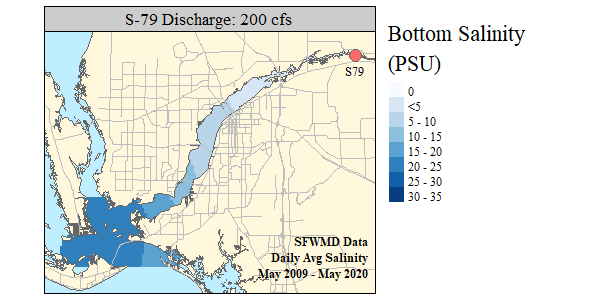

```{r setup, include=FALSE}
knitr::opts_chunk$set(echo = TRUE)
```

This repository is intended for data analysis specific to retrieving information, visualizing and presenting information related to condition within the Caloosahatchee - Okeechobee system.

* Salinity Spatial Model - *In Development*

```{r ,echo=F,fig.align="center",out.width="79%"}


```

* Conditions Report 
    * [Link](https://sccf-tech.github.io/CRE_Conditions/report/CRE_REPORT.html)

* Stakeholder Report Information
    * Link